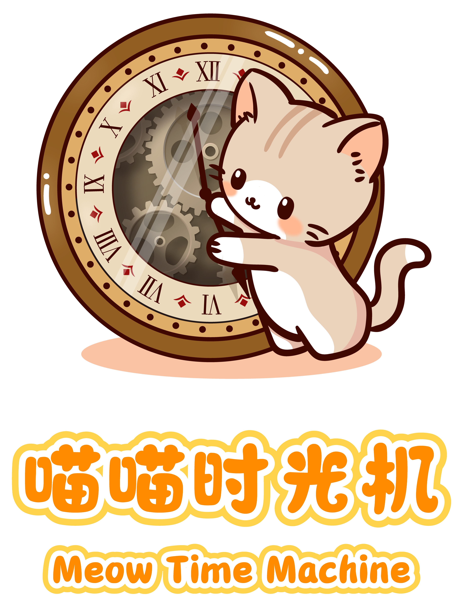

<!-- PROJECT LOGO -->

   
  <h2 align="center">喵喵时光机</h2>
  <h3 align="center">Meow Time Machine</h3>
  

    即将发布，敬请期待
     
    <a href="https://github.com/Ketty0725/Meow-Time-Machine"><strong>探索本项目的文档 »</strong></a>
     
     
    <a href="https://github.com/Ketty0725/Meow-Time-Machine/issues">报告Bug</a>
    ·
    <a href="https://github.com/Ketty0725/Meow-Time-Machine/issues">提出新特性</a>
  

<!-- PROJECT SHIELDS -->

[![Forks][forks-shield]][forks-url]
[![Stargazers][stars-shield]][stars-url]
[![Issues][issues-shield]][issues-url]
[![MIT License][license-shield]][license-url]

本工具由预言小猫使用SwiftUI语言独立开发完成

如果本工具对你有所帮助，请帮忙点点star🌟

### 上手指南
sileo或saily添加软件源：https://ketty0725.github.io/repo/

### 插件介绍

### 更新日志

### 演示

<!-- links -->
[your-project-path]:Ketty0725/Meow-Time-Machine
[forks-shield]: https://img.shields.io/github/forks/Ketty0725/Meow-Time-Machine.svg?style=flat-square
[forks-url]: https://github.com/Ketty0725/Meow-Time-Machine/network/members
[stars-shield]: https://img.shields.io/github/stars/Ketty0725/Meow-Time-Machine.svg?style=flat-square
[stars-url]: https://github.com/Ketty0725/Meow-Time-Machine/stargazers
[issues-shield]: https://img.shields.io/github/issues/Ketty0725/Meow-Time-Machine.svg?style=flat-square
[issues-url]: https://img.shields.io/github/issues/Ketty0725/Meow-Time-Machine.svg
[license-shield]: https://img.shields.io/github/license/Ketty0725/Meow-Time-Machine.svg?style=flat-square
[license-url]: https://github.com/Ketty0725/Meow-Time-Machine/blob/main/LICENSE
